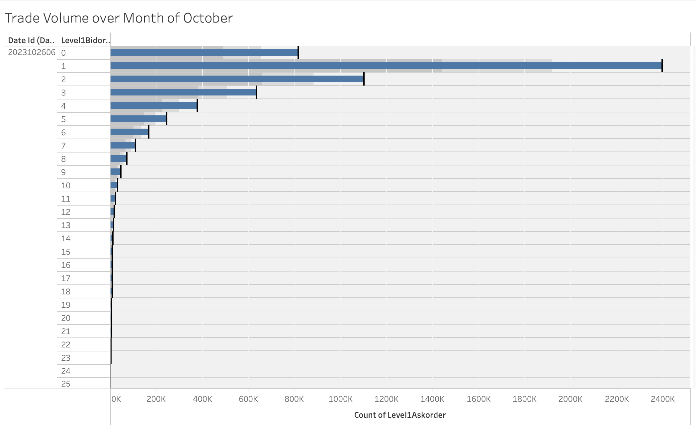
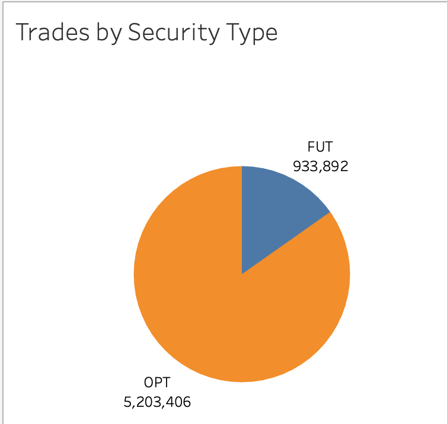
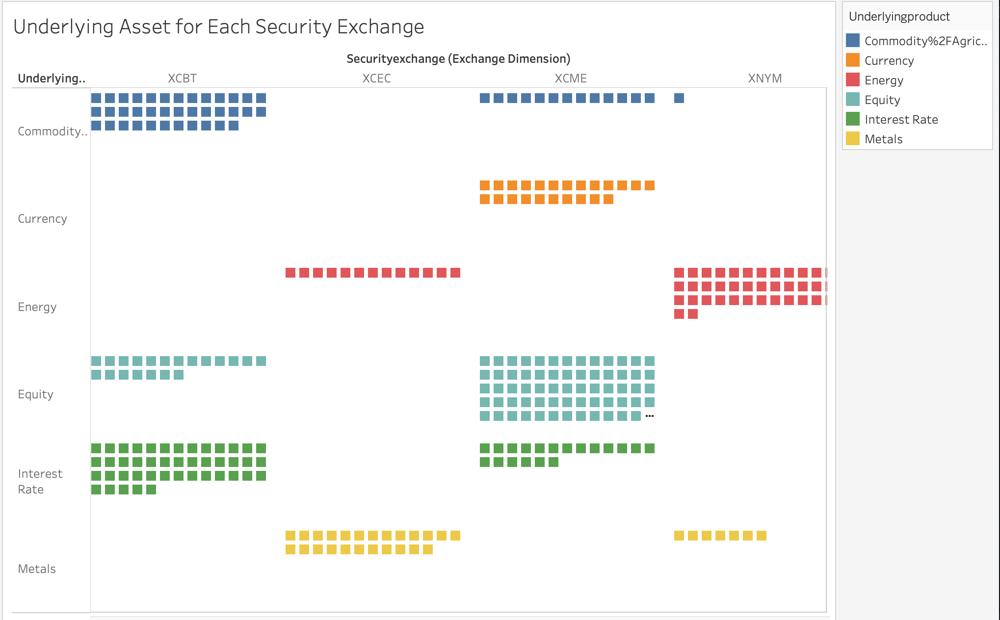

# CME Data Warehouse
## Data Warehousing Project - CIS 4400
### Team 7 - Nidhi Shah, Ramisa Alam, Humaiya Sawda, Emma Greenbaum

# Description
This project aims to create a centralized and efficient data management system that can handle the vast volumes of data generated by CME transactions. 

# Business Environment
## Business Problem 
CME is a financial services firm specializing in analyzing and trading commodities and derivatives, focusing on products offered by the Chicago Mercantile Exchange. The company handles large amounts of data related to market trends, trading columns, price movements, etc. which is crucial for making informed investment decisions. The company has a significant global presence, serving a diverse clientele including institutional investors, traders, hedgers, and speculators. 

Requirements: 
* Data warehouse architecture robust enough to handle large volumes of CME data, including historical and real-time data streams
* Integration of multiple data sources like trade histories, order books, market depth, and trading participant information 
* Data must be processed in real-time to capture live market data updates like price changes, trading volumes, and order executions
* Manage reference data (trading symbols, market codes, etc.)
* Monitor data and set up alerts to track system performance metrics

In an ideal world, we would be able to go through all of these requirements, but because of our time constraints, we focused on the first requirement.

## Business Impact 
Setting up a data warehouse for CME data and reference data is a major project with significant benefits and considerations:

Benefits:
- Informed decision-making through data analysis
- Improved operational efficiency
- Enhanced risk management
- Competitive advantage

Risks:
- Data accuracy and integrity are critical for reliable analysis.
- Data security must be robust to protect sensitive financial information.
- Compliance with regulations is crucial to avoid legal issues and penalties.

Costs: 
- Infrastructure costs for servers, storage, and software.
- Data integration costs may require additional tools and resources.
- Maintenance costs for ongoing data accuracy and performance.

Successfully managing these risks and costs while leveraging the benefits can lead to valuable insights and efficiencies in financial market analysis and decision-making.

## Business Persona
Risk managers, financial analysts, traders, and market researchers would all be interested in the system. These individuals would be interested in the data stored because it can help them understand market patterns based on historical data. It will also assist them to make strategic decisions and analyze future market behavior. Having access to historical and present data can significantly improve financial outcomes and investing strategies. Data analysts can help these individuals better comprehend the data by allowing them to interact with it and evaluate it using various tools. Finally, data engineers and scientists can help in maintaining the data warehouse and implementing machine learning algorithms. 

# Data 
## Data Sources 
This is the [link](https://datamine.cmegroup.com/#/query-product/details/query_instrument_record) to the data source - we have only extracted the data for one month and analyzed the level1 trades and general attributes.

## Metadata
This is the link to the data dictionary: [data dictionary](https://datamine.cmegroup.com/#/query-product/details/query_order_record)

# Methods
We first created a Dimensional Model that includes fact & dimension tables, this model will help us understand the relationship between the different columns. After performing transformation on the data, we updated the model with the new column we created which is date_yyy. 

## ETL 

Extract: 
We extracted the JSON files in chunks to allow for faster processing and helped load the data for transformation. The code can be found in the data sourcing folder. 

Transform: For the transformation process, we utilized dbt (data build tool) to manage and execute our SQL transformations. dbt allowed us to define models for cleaning and standardizing the raw data. We created modular SQL queries to perform these transformations, ensuring data integrity through testing and documentation. By running dbt commands, we applied these transformations to our raw data, preparing it for loading.

Load: The loading process involved moving the transformed data into Snowflake. We configured our Snowflake connection in dbt and executed the dbt models to load the data into Snowflake tables. This included handling incremental loads for efficiency, and ensuring that only new or changed data was processed in subsequent runs. This setup optimized the storage and accessibility of our data in Snowflake, making it ready for analysis and reporting.

# Data Tools 
Dimensional Model: DB schema

Storage: Azure Blob 

Database: Snowflake 

Transformation: dbt (data build tool)

# Visualizations

Here are some of the visualizations we made! You can check out more of them on our [Tableau Public Server](https://public.tableau.com/app/profile/nidhi.shah7928/viz/CMEdata_17159993362020/NumberofTradesineachSecurityExchange?publish=yes)

# Presentation
We put together an 8-minute presentation going over the foundation of our project and the next steps we were going to take at the time of the presentation. You can find the deck [here](https://docs.google.com/presentation/d/1WeVVeRmvnjZvtfD_FetAdAKseBGUjY-1srH5XmqMvng/edit?usp=sharing)
